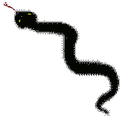

# iasPP

Meaning: Iago ActionScript++;

## About

C++ Library to make easier to create games. Created using Qt Creator. I'm writing this lib for personal use and with my freetime, so don't expect many updates. Sorry!

If you find any "iagogamelib", or "aspp" please tell me to remove/update it. Thanks!



## Special Thanks to

| Site | Why? |
| :--- | ---: |
| https://www.libsdl.org/ | SDL ( S2 ) |
| http://www.willusher.io/pages/sdl2/ | basics, c++ |
| http://www.java2s.com/ | simple codes |
| http://lazyfoo.net/tutorials/SDL/ | basics |
| https://stackoverflow.com/ | doubts, sdl2, libVLC, c++, c etc |
| http://forums.linuxmint.com/ | doubts |
| http://www.linuxquestions.org | doubts |
| http://pubs.opengroup.org/onlinepubs/7908799/xsh/sysstat.h.html | mkdir - linux |
| https://duckduckgo.com/ | found pages :P |
| http://qt-project.org/ | Qt Creator |
| https://github.com | Free storage |
| https://wiki.videolan.org/LibVLC_Users/ | libVLC |
| https://wiki.videolan.org/LibVLC_SampleCode_SDL/ | libVLC |
| http://spin.atomicobject.com/2013/01/13/exceptions-stack-traces-c/ | stacktrace for windows and linux |
| http://higherorderfun.com/blog/2012/06/03/math-for-game-programmers-05-vector-cheat-sheet/#more-123 | math |
| http://madebyevan.com/obscure-cpp-features/ | helpful obscure codes |
| https://github.com/ | GitHub |
| http://gcc.gnu.org/wiki/Visibility | library in Linux |

### Notes

In **windows**, I've included "windows.h", so I had to fix **Rectangle**:

```cpp
#ifdef __MINGW32__
    #define Rectangle winRectangle
    #include <windows.h>
    #undef Rectangle
#include <lmcons.h>
```

### Changes
| How should be | How it is | Why? |
| :------------ | :-------: | ---: |
| MouseEvent::DOUBLE_CLICK | MouseEvent::DOUBLE_CLICK_ | wincon.h  defines it|

### Tasks
#### Tested
- [ ] Windows tested
- [x] Linux tested (Mint only)
- [ ] ~~Mac tested~~ No ios. Sorry.

##### next steps
* rewrite to use smart pointers
* finish MouseMove event
* finish TextField
* test TextField


## Requirements
* C++17
* SDL2
* libVLC
* FFMPEG
